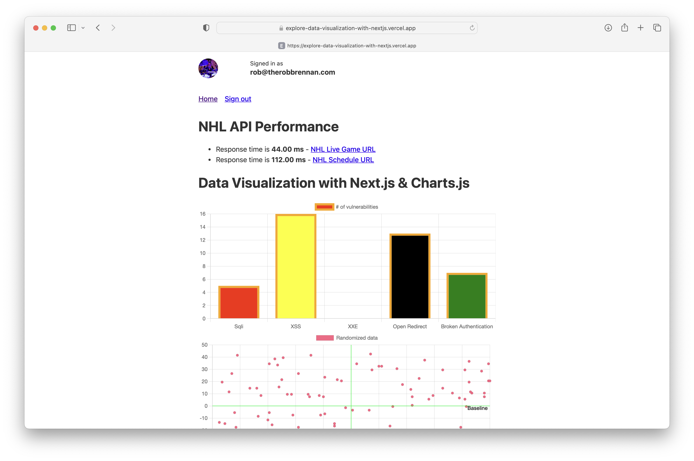
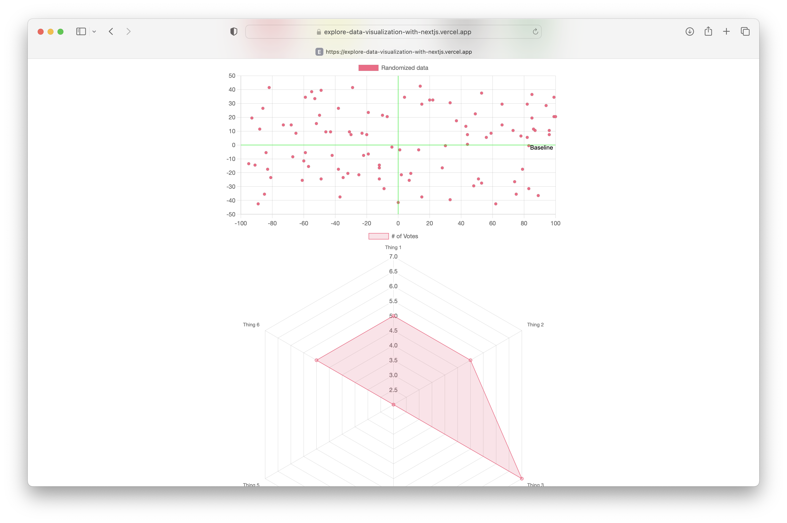

# Overview

This project is based off previous work from my [repo](https://github.com/TheRobBrennan/nextjs-with-next-auth) exploring how to incorporate `next-auth` into a simple Next.js app using GitHub for user authentication using the new App router instead of the traditional `pages` directory.

The deployed version of this project can be found at [https://explore-data-visualization-with-nextjs.vercel.app](https://explore-data-visualization-with-nextjs.vercel.app)

If you click the *Sign In* button, you can log in and see your user profile in the header:




## Getting Started

### 1. Clone the repository and install dependencies

```
% git clone https://github.com/TheRobBrennan/explore-data-visualization-with-nextjs.git
% cd explore-data-visualization-with-nextjs
% npm install
```

### 2. Configure your local environment

Copy the .env.local.example file in this directory to .env.local (which will be ignored by Git):

```
cp .env.local.example .env.local
```

Add details for one or more providers (e.g. Google, Twitter, GitHub, Email, etc).

#### Database

A database is needed to persist user accounts and to support email sign in. However, you can still use NextAuth.js for authentication without a database by using OAuth for authentication. If you do not specify a database, [JSON Web Tokens](https://jwt.io/introduction) will be enabled by default.

You **can** skip configuring a database and come back to it later if you want.

For more information about setting up a database, please check out the following links:

- Docs: [next-auth.js.org/adapters/overview](https://next-auth.js.org/adapters/overview)

### 3. Configure Authentication Providers

1. Review and update options in `app/api/auth/[...nextauth]/route.ts` as needed.

2. When setting up OAuth, in the developer admin page for each of your OAuth services, you should configure the callback URL to use a callback path of `{server}/api/auth/callback/{provider}`.

e.g. For Google OAuth you would use: `http://localhost:3000/api/auth/callback/google`

A list of configured providers and their callback URLs is available from the endpoint `/api/auth/providers`. You can find more information at https://next-auth.js.org/configuration/providers/oauth

3. You can also choose to specify an SMTP server for passwordless sign in via email.

### 4. Start the application

To run your site locally, use:

```
npm run dev
```

To run it in production mode, use:

```
npm run build
npm run start
```
